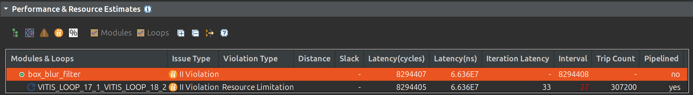
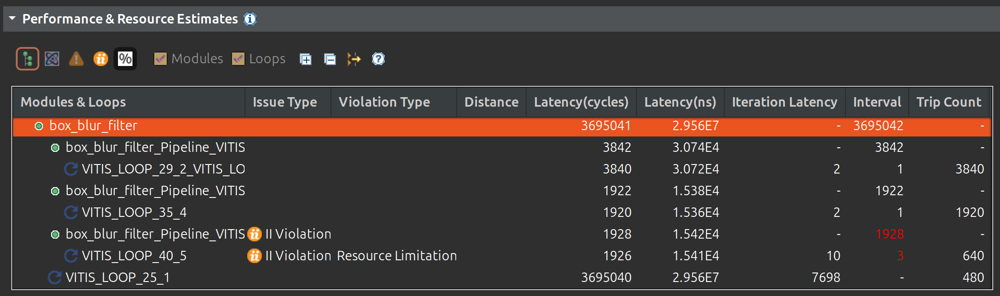
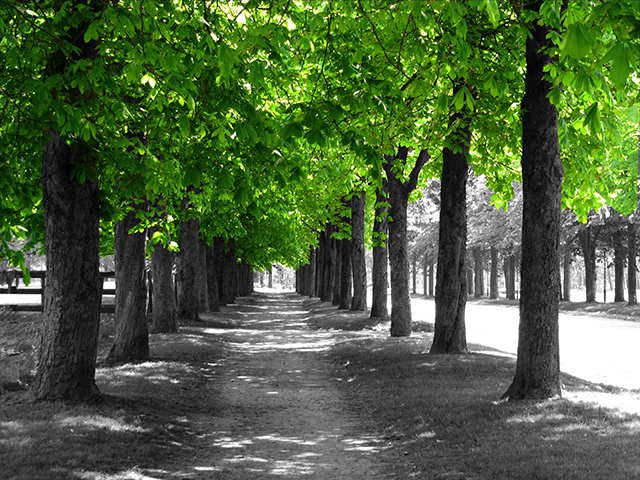
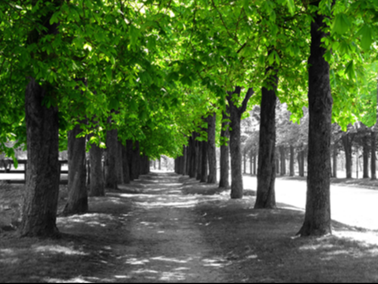

## **Box Blur Filter HLS Optimization Project Overview**

This document provides a detailed overview of the Box Blur image filter project, demonstrating the process of implementing and optimizing a computational kernel for High-Level Synthesis (HLS). The goal is to accelerate image processing tasks on FPGAs, and this project showcases key techniques for achieving high performance in hardware.  
The project follows an iterative optimization approach, starting with a basic C/C++ implementation and progressively applying HLS-specific optimizations. The hardware design (synthesized C/C++) was then integrated with a host application written in Rust to form a complete system.

### **Phase 1: Initial Software-Hardware Co-design & Baseline Performance**

* **Objective:** To establish a functionally correct C/C++ implementation of the Box Blur filter and obtain a baseline performance estimate from HLS. This phase focused on getting the core algorithm right and understanding the initial hardware mapping.  
* **Implementation Characteristics:**  
  * The box\_blur\_filter C/C++ function directly accesses input\_pixels and output\_pixels using standard 2D array indexing.  
  * For hardware interfacing, \#pragma HLS INTERFACE s\_axilite was used for all function arguments (return value, input\_pixels, output\_pixels). AXI4-Lite is a simple, memory-mapped interface often used for control and status registers.  
  * Initial performance directives included \#pragma HLS UNROLL on the inner kernel loops.  
* **Performance (from Synthesis Report \- c\_synth_no_buffer.rpt):**  

  * **Overall Latency:** Extremely high (e.g., approximately 8.3 million clock cycles for a 640x480 image).  
  * **Main Processing Loop (VITIS\_LOOP\_22\_1\_VITIS\_LOOP\_23\_2):** This combined loop, representing the main image processing, had a very high Initiation Interval (II) (e.g., II=27).  
* **Analysis & Bottleneck Identification:**  
  * The primary bottleneck in this phase was the **s\_axilite interface** used for the large input\_pixels and output\_pixels arrays. AXI4-Lite is inherently a low-bandwidth interface. HLS was forced to perform many sequential transfers to fetch each row of pixels, severely limiting the overall data throughput.  
  * Even though internal loops were unrolled, the slow external data access starved the internal processing units, preventing the top-level function from achieving a low II.

### **Phase 2: On-Chip Memory Optimization with Line Buffer**

* **Objective:** To significantly improve the internal data access efficiency and enable higher parallelism within the core blur computation by leveraging on-chip memory.  
* **Implementation Characteristics:**  
  * An explicit line\_buffer (unsigned char line\_buffer\[BLUR\_SIZE\]\[IMAGE\_WIDTH \* 3\]) was introduced within the box\_blur\_filter function. This buffer is designed to hold the BLUR\_SIZE (e.g., 3\) rows of pixels necessary for the 3x3 convolution window.  
  * The crucial \#pragma HLS ARRAY\_PARTITION variable=line\_buffer complete dim=1 was applied to this line buffer. This directive tells HLS to implement each row of the buffer as an independent memory block or set of registers, allowing simultaneous access to all rows needed for the blur calculation.  
  * The blur calculation logic was modified to read pixels from this internal line\_buffer instead of directly from input\_pixels.  
  * A "streaming" mechanism was implemented: for each new input row, the oldest row in the line\_buffer is shifted out, and the new row from input\_pixels is loaded into the buffer.  
  * The external interfaces for input\_pixels and output\_pixels **remained s\_axilite** in this version to isolate the impact of the line buffer optimization.  
* **Performance (from Synthesis Report \- c\_synth_axilite.rpt):**  

  * **Overall Latency:** Significantly improved compared to Version 1 (e.g., reduced from \~8.3 million to \~3.7 million cycles).  
  * **Internal Loops (Line Buffer Update, Core Pixel Processing):** Achieved very low IIs (e.g., II=1 for line buffer shifts/loads, II=3 for core pixel processing). This demonstrates highly efficient internal computation.  
* **Analysis & Remaining Limitations:**  
  * **Significant Improvement:** The explicit line\_buffer with ARRAY\_PARTITION and the UNROLL pragmas on the kernel loops drastically improved the **internal efficiency** of the blur calculation. By buffering rows on-chip and allowing parallel access, the core pixel processing could achieve a much lower II.  
  * **Persistent Limitation:** The overall latency remained high because the **s\_axilite interface** for input\_pixels and output\_pixels was *still* the bottleneck. Even though the internal processing was fast, it still had to wait for the slow s\_axilite interface to transfer each full row into and out of the line buffer. This highlights that optimizing internal logic is necessary but not sufficient if external data access is constrained.

### **Host Application Integration (Rust Proof of Concept)**

Beyond the HLS synthesis, a crucial part of this project involves demonstrating how the hardware accelerator would be used in a larger system. This is achieved through a host application written in Rust.

* **Objective:** To create a software proof of concept that interacts with the HLS-generated C/C++ function (compiled as a shared library), simulating the host-accelerator communication.  
* **Implementation Details:**  
  * **Environment:** The host application is built and run on a **64-bit Ubuntu** system.  
  * The C/C++ box\_blur\_filter (from either Phase 1 or Phase 2\) is compiled into a shared library (e.g., libbox\_blur\_filter.so) using a standard C++ compiler like g++.  
  * A Rust application is developed to:  
    * Load an input image using the image crate. The program is flexible and can either use a default dummy image or an image specified via a command-line argument.  
    * Prepare the image data into a flat, C-compatible Vec\<u8\> (a vector of bytes).  
    * Use its Foreign Function Interface (FFI) capabilities (extern "C") to load the libbox\_blur\_filter.so shared library.  
    * Call the box\_blur\_filter function, passing the input and output image data pointers (\*mut u8).  
    * Convert the processed output data back into an ImageBuffer and then save it as a new PNG file. The output filename is automatically generated by prepending "output\_" to the original input filename, providing a clear distinction between the source and result.  
    
#### **C++ Shared Library Compilation & FFI Preparation**

Before the Rust host application can call the C/C++ box\_blur\_filter function, the C++ code must be compiled into a format that Rust's Foreign Function Interface (FFI) can link against. This is achieved by creating a shared library (.so file on Linux).

* **Command:**  
  Bash  
  g++ \-shared \-o libbox\_blur\_filter.so \-fPIC box\_blur.cpp \-I. \-std=c++11  
* Result:  
  Executing this command produced libbox\_blur\_filter.so. This single file encapsulates the compiled machine code for the box\_blur\_filter function. The Rust host application can then use the \[link\] attribute and extern "C" block to find and call this function from the shared library at runtime. This step bridges the gap between the C/C++ kernel implementation and the high-level Rust host application, enabling the software-hardware co-design workflow.

* **Usage on Ubuntu 64-bit:**  
  1. **Install Rust:** If not already installed, use rustup to get the necessary toolchain:  
     Bash  
     curl \--proto '=https' \--tlsv1.2 \-sSf https://sh.rustup.rs | sh  
     source $HOME/.cargo/env

  2. **Navigate to Project Directory:** Change your current directory to the location of the Rust host application (e.g., cd box\_blur\_host).  
  3. **Run the Application:**  
     * **With a custom image:** To blur a specific image, provide its path as a command-line argument. The LD\_LIBRARY\_PATH=. is crucial to tell the linker where to find the libbox\_blur\_filter.so shared library at runtime.  
       Bash  
       LD\_LIBRARY\_PATH=. cargo run \-- \<path\_to\_your\_image.png\>

       Example:  
       Bash  
       LD\_LIBRARY\_PATH=. cargo run \-- tree\_640\_480.png

       This will create a new file named output\_tree\_640\_480.png.  
     * **With the default dummy image:** If no argument is provided, the script will automatically create a sample\_input\_image.png if it doesn't exist, and then process it.  
       Bash  
       LD\_LIBRARY\_PATH=. cargo run

       This will create an output\_sample\_input\_image.png.  

This project effectively demonstrates the iterative process of HLS optimization, from initial functional implementation to addressing performance bottlenecks through on-chip memory management. It also highlights the critical aspect of software-hardware co-design, showing how an HLS-accelerated kernel would fit into a complete system. Detailed synthesis reports for each version, providing precise latency, initiation interval, and resource utilization figures, can be found in the csynth_reports directory (typically named c\_synth.rpt).

turns into...

