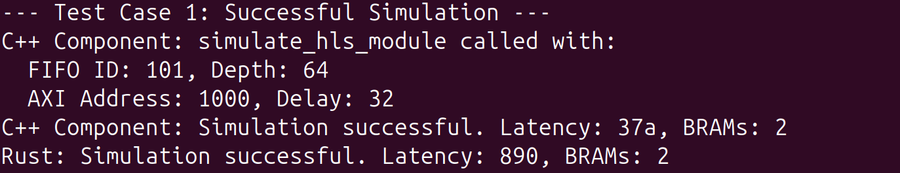

# **README: HLS Component Simulation with Rust & C++ FFI**

This project demonstrates dynamic loading and Foreign Function Interface (FFI) interactions between Rust and C++, simulating a simplified High-Level Synthesis (HLS) component, particularly related to low-level system interactions, dynamic linking, and debugging at FFI boundaries.

## **1\. Key Concepts Demonstrated**

* **Foreign Function Interface (FFI):** How Rust and C++ code can call each other.  
* **Dynamic Linking:** Loading shared libraries (.so files) at runtime.  
* **Symbol Resolution:** The process by which the linker finds function definitions.  
* **Name Mangling:** How C++ compilers encode function signatures into symbol names.  
* **extern "C":** The C++ keyword to prevent name mangling for C-compatible linkage.  
* **GNU Binutils (nm):** A practical application of a common Linux tool for inspecting binary symbols.  
* **Simulated HLS Logic:** Basic understanding of latency calculation, BRAM estimation, and deadlock detection in hardware simulation.  
* **Error Propagation:** Handling and mapping errors across language boundaries.

## **2\. Project Structure**

The project consists of two main parts:

* **C++ Component:** A simple C++ shared library (libsim\_component.so) that simulates an HLS-generated module's behavior, including latency calculation, BRAM estimation, and error conditions.  
* **Rust Application:** A Rust executable (hls\_sim\_loader) that dynamically loads the C++ shared library and calls its functions, demonstrating FFI, dynamic linking, and name mangling.

```
├── hls\_sim\_loader/             \# Rust application directory  
│   ├── Cargo.toml  
│   └── src/  
│       └── main.rs  
├── sim\_component.h             \# C++ header file  
└── sim\_component.cpp           \# C++ source file  
```

## **3\. Setup Instructions**

This guide uses g++ (C++ compiler) and Rust (with cargo) installed on an Ubuntu-like Linux system.

### **3.1. C++ Component Setup**

1. Create HEADERFILE.h:  
   Create a file named sim\_component.h with the following content. Pay close attention to the placement of extern "C" to control name mangling.

```
\#ifndef SIM\_COMPONENT\_H  
\#define SIM\_COMPONENT\_H

\#ifdef \_\_cplusplus //only compile if C++  
extern "C" { // Don't mangle  
\#endif

// Define simple types to mimic HLS concepts  
typedef unsigned long long ClockCycle; // Corresponds to Rust's u64  
typedef unsigned int FifoId;  
typedef unsigned int AxiAddress;

// Struct to hold simulation results like Dsepoint  
//https://github.com/sharc-lab/LightningSim/blob/main/backend/lightningsim-core/lib.rs\#L106  
typedef struct {  
    ClockCycle latency; // 0 for no result/deadlock  
    int bram\_count;  
    int error\_code; // 0 for success  
} SimResult;

// Function mimicking CompiledSimulation::resolve or DSE logic  
// Inputs:  
//   fifo\_depth: A single FIFO depth for simplicity  
//   axi\_delay: A single AXI delay for simplicity  
// Output: SimResult struct with calculated latency, BRAMs, and potential error.  
SimResult simulate\_hls\_module(FifoId fifo\_id, int fifo\_depth, AxiAddress axi\_addr, ClockCycle axi\_delay);

\#ifdef \_\_cplusplus  
}  
\#endif

// A C++-only function (without extern "C") to demonstrate name mangling  
\#ifdef \_\_cplusplus  
int cpp\_mangled\_function(int x, float y);  
\#endif

\#endif // SIM\_COMPONENT\_H  
```

2. Create HLS\_COMPONENT.cpp:  
   Create a file named sim\_component.cpp with the following content:

```
\#include "sim\_component.h"  
\#include \<iostream\>   
\#include \<string\> // For string operations

// Simple BRAM calculation logic to mimic fifo::get\_bram\_count  
//https://github.com/sharc-lab/LightningSim/blob/main/backend/lightningsim-core/fifo.rs  
int calculate\_bram\_count(int width, int depth) {  
    // Very simplified: assuming 1 BRAM per 1024 bits (128 bytes) of capacity  
    // and a minimum of 1 BRAM if depth \> 0  
    if (depth \== 0\) return 0;  
    int bits \= width \* depth;  
    return (bits \+ 1023\) / 1024; // 1025 bits \= 2 BRAMs  
}

// Simple calculation function (Test Case 1\) to mimic bram usage and latency calculation  
SimResult simulate\_hls\_module(FifoId fifo\_id, int fifo\_depth, AxiAddress axi\_addr, ClockCycle axi\_delay) {  
    std::cout \<\< "C++ Component: simulate\_hls\_module called with:" \<\< std::endl;  
    std::cout \<\< "  FIFO ID: " \<\< fifo\_id \<\< ", Depth: " \<\< fifo\_depth \<\< std::endl;  
    std::cout \<\< "  AXI Address: " \<\< std::hex \<\< axi\_addr \<\< ", Delay: " \<\< axi\_delay \<\< std::endl;

    SimResult result \= {0, 0, 0}; // Initialize result struct

    // Simulate DeadlockDetected (Test Case 2): If FIFO depth is 0, consider it a deadlock  
    if (fifo\_depth \<= 0\) {  
        std::cerr \<\< "C++ Component: Error \- DeadlockDetected due to zero or negative FIFO depth\!" \<\< std::endl;  
        result.error\_code \= 1; // Arbitrary error code for deadlock  
        result.latency \= 0; // Indicate no valid latency  
        result.bram\_count \= 0;  
        return result;  
    }

    // Simulate FifoDepthNotProvided (Test Case 3\)  
    if (fifo\_depth \== \-1) { // Use \-1 as a special "not provided" indicator  
        std::cerr \<\< "C++ Component: Error \- FifoDepthNotProvided for FIFO ID " \<\< fifo\_id \<\< "\!" \<\< std::endl;  
        result.error\_code \= 2;  
        result.latency \= 0;  
        result.bram\_count \= 0;  
        return result;  
    }  
      
    //Simulate AxiDelayNotProvided (Test Case 4\)  
    if (axi\_delay \== 0\) { // Use 0 as a special "not provided" indicator for delay  
        std::cerr \<\< "C++ Component: Error \- AxiDelayNotProvided for AXI Address " \<\< std::hex \<\< axi\_addr \<\< "\!" \<\< std::endl;  
        result.error\_code \= 3;  
        result.latency \= 0;  
        result.bram\_count \= 0;  
        return result;  
    }

    // Basic latency calculation which increases with FIFO depth and AXI delay  
    result.latency \= (ClockCycle)fifo\_depth \* 10 \+ axi\_delay \* 5;

    // Assume a fixed FIFO width for this component, e.g., 32 bits  
    result.bram\_count \= calculate\_bram\_count(32, fifo\_depth);

    std::cout \<\< "C++ Component: Simulation successful. Latency: " \<\< result.latency  
              \<\< ", BRAMs: " \<\< result.bram\_count \<\< std::endl;  
    return result;  
}

\#ifdef \_\_cplusplus //only compiled if C++ compiler

int cpp\_mangled\_function(int x, float y) {  
// This function will be name-mangled  
    std::cout \<\< "C++ Component: cpp\_mangled\_function(" \<\< x \<\< ", " \<\< y \<\< ") called." \<\< std::endl;  
    return x \+ static\_cast\<int\>(y);  
}  
\#endif  
```

3. Compile the C++ Shared Library:  
   Open your terminal in the directory where you saved sim\_component.h and sim\_component.cpp, and run:

```
g++ \-shared \-o libsim\_component.so sim\_component.cpp \-fPIC  
```

* \-shared: Creates a shared library.  
  * \-o libsim\_component.so: Specifies the output filename.  
  * \-fPIC: Generates Position-Independent Code, necessary for shared libraries.  
4. Verify Symbols with nm:  
   Use the nm utility to inspect the symbols in the generated shared library. This is crucial to confirm name mangling.

```
nm \-D libsim\_component.so | grep simulate\_hls\_module  
nm \-D libsim\_component.so | grep cpp\_mangled\_function  
```
	**Expected Output (similar to):**  
```
0000000000001316 T simulate\_hls\_module  
000000000000166d T \_Z20cpp\_mangled\_functionif  
```
Notice that simulate\_hls\_module is unmangled, while cpp\_mangled\_function has a mangled name (e.g., \_Z20cpp\_mangled\_functionif). Make a note of the mangled name for cpp\_mangled\_function.

### **3.2. Rust Application Setup**

1. Create a New Rust Project:  
   Open your terminal and run:

```
cargo new hls\_sim\_loader  
cd hls\_sim\_loader  
```

2. Add libloading Dependency:  
   Edit your Cargo.toml file to add the libloading crate:

```
\[dependencies\]  
libloading \= "0.8"  
```

3. Update src/main.rs:  
   Replace the content of hls\_sim\_loader/src/main.rs with the following code. Remember to replace "ACTUAL\_MANGLED\_NAME" with the exact mangled name you obtained from nm in step 4.1.4.

```
use libloading::{Library, Symbol};  
use std::error::Error;  
use std::fmt;  
use std::ffi::{c\_int, c\_uint}; // For C types: int, unsigned int

// Rust representation of SimResult, match C implementation  
\#\[repr(C)\]  
\#\[derive(Debug)\]  
struct SimResultC {  
    latency: u64, // ClockCycle in C  
    bram\_count: c\_int,  
    error\_code: c\_int,  
}

// Rust enum to map C error codes to meaningful errors, similar to SimulationError  
\#\[derive(Debug)\]  
enum SimulationErrorRust {  
    DeadlockDetected,  
    FifoDepthNotProvided(u32),  
    AxiDelayNotProvided(u32),  
    OtherCError(c\_int), // For unhandled C error codes  
    LibraryLoadError(String),  
    SymbolNotFound(String),  
    // Add more as needed  
}  
impl fmt::Display for SimulationErrorRust {  
    fn fmt(\&self, f: \&mut fmt::Formatter\<'\_\>) \-\> fmt::Result {  
        match self {  
            SimulationErrorRust::DeadlockDetected \=\> write\!(f, "Deadlock detected (simulated by C component)"),  
            SimulationErrorRust::FifoDepthNotProvided(id) \=\> write\!(f, "FIFO depth not provided for ID {} (simulated by C component)", id),  
            SimulationErrorRust::AxiDelayNotProvided(addr) \=\> write\!(f, "AXI delay not provided for address {:\#010x} (simulated by C component)", addr),  
            SimulationErrorRust::OtherCError(code) \=\> write\!(f, "Unhandled C component error code: {}", code),  
            SimulationErrorRust::LibraryLoadError(msg) \=\> write\!(f, "Failed to load library: {}", msg),  
            SimulationErrorRust::SymbolNotFound(name) \=\> write\!(f, "Symbol '{}' not found in library", name),  
        }  
    }  
}  
impl Error for SimulationErrorRust {} // Make it a proper error type

// Define the type of the C function for Rust's FFI  
type SimulateHlsModuleFn \= unsafe extern "C" fn(c\_uint, c\_int, c\_uint, u64) \-\> SimResultC;  
type CppMangledFunctionFn \= unsafe extern "C" fn(c\_int, f32) \-\> c\_int; // For the mangled function

fn main() \-\> Result\<(), Box\<dyn Error\>\> {  
    let lib\_path \= "./libsim\_component.so";

    // Load the shared library  
    println\!("Rust: Attempting to load library from: {}", lib\_path);  
    let lib \= unsafe {  
        Library::new(lib\_path)  
            .map\_err(|e| SimulationErrorRust::LibraryLoadError(e.to\_string()))?  
    };  
    println\!("Rust: Library loaded successfully.\\n");

    // Resolve the 'simulate\_hls\_module' symbol  
    println\!("Rust: Resolving symbol 'simulate\_hls\_module'...");  
    let simulate\_hls\_module: Symbol\<SimulateHlsModuleFn\> \= unsafe {  
        lib.get(b"simulate\_hls\_module\\0")  
            .map\_err(|e| SimulationErrorRust::SymbolNotFound(format\!("simulate\_hls\_module: {}", e)))?  
    };  
    println\!("Rust: Symbol 'simulate\_hls\_module' resolved.\\n");

    // \--- Test Cases \---

    // Test Case 1: Successful simulation  
    println\!("--- Test Case 1: Successful Simulation \---");  
    let result1 \= unsafe { simulate\_hls\_module(101, 64, 0x1000, 50\) };  
    match result1.error\_code {  
        0 \=\> println\!("Rust: Simulation successful. Latency: {}, BRAMs: {}\\n", result1.latency, result1.bram\_count),  
        \_ \=\> eprintln\!("Rust: Simulation failed with error code: {}. This should not happen here.\\n", result1.error\_code),  
    }

    // Test Case 2: Simulated DeadlockDetected  
    println\!("--- Test Case 2: Simulated DeadlockDetected (FIFO depth 0\) \---");  
    let result2 \= unsafe { simulate\_hls\_module(102, 0, 0x1004, 30\) };  
    let simulation\_error: Result\<(), SimulationErrorRust\> \= match result2.error\_code {  
        0 \=\> Ok(()),  
        1 \=\> Err(SimulationErrorRust::DeadlockDetected),  
        \_ \=\> Err(SimulationErrorRust::OtherCError(result2.error\_code)),  
    };  
    if let Err(e) \= simulation\_error {  
        eprintln\!("Rust: Caught expected simulation error: {}\\n", e);  
    } else {  
        println\!("Rust: Unexpectedly successful simulation for deadlock scenario.\\n");  
    }

    // Test Case 3: Simulated FifoDepthNotProvided  
    println\!("--- Test Case 3: Simulated FifoDepthNotProvided (FIFO depth \-1) \---");  
    let result3 \= unsafe { simulate\_hls\_module(103, \-1, 0x1008, 40\) };  
    let simulation\_error: Result\<(), SimulationErrorRust\> \= match result3.error\_code {  
        0 \=\> Ok(()),  
        2 \=\> Err(SimulationErrorRust::FifoDepthNotProvided(103)),  
        \_ \=\> Err(SimulationErrorRust::OtherCError(result3.error\_code)),  
    };  
    if let Err(e) \= simulation\_error {  
        eprintln\!("Rust: Caught expected simulation error: {}\\n", e);  
    } else {  
        println\!("Rust: Unexpectedly successful simulation for missing FIFO depth.\\n");  
    }

    // Test Case 4: Simulated AxiDelayNotProvided  
    println\!("--- Test Case 4: Simulated AxiDelayNotProvided (AXI delay 0\) \---");  
    let result4 \= unsafe { simulate\_hls\_module(104, 32, 0x100C, 0\) };  
    let simulation\_error: Result\<(), SimulationErrorRust\> \= match result4.error\_code {  
        0 \=\> Ok(()),  
        3 \=\> Err(SimulationErrorRust::AxiDelayNotProvided(0x100C)),  
        \_ \=\> Err(SimulationErrorRust::OtherCError(result4.error\_code)),  
    };  
    if let Err(e) \= simulation\_error {  
        eprintln\!("Rust: Caught expected simulation error: {}\\n", e);  
    } else {  
        println\!("Rust: Unexpectedly successful simulation for missing AXI delay.\\n");  
    }

    // \--- Demonstrate C++ Name Mangling \---  
    println\!("--- Demonstrating C++ Name Mangling \---");

    // This will fail because the name is mangled.  
    println\!("Rust: Attempting to resolve 'cpp\_mangled\_function' (unmangled)...");  
    match unsafe { lib.get::\<Symbol\<CppMangledFunctionFn\>\>(b"cpp\_mangled\_function\\0") } {  
        Ok(\_) \=\> println\!("Rust: Unexpectedly resolved 'cpp\_mangled\_function'."),  
        Err(e) \=\> eprintln\!("Rust: Failed to resolve 'cpp\_mangled\_function' (unmangled) as expected: {}", e),  
    }

    // Actual mangled function name  
    let mangled\_name \= "\_Z20cpp\_mangled\_functionif\\0";  
    println\!("Rust: Attempting to resolve 'cpp\_mangled\_function' with mangled name: {}...", mangled\_name);  
    match unsafe { lib.get::\<Symbol\<CppMangledFunctionFn\>\>(mangled\_name.as\_bytes()) } {  
        Ok(mangled\_func) \=\> {  
            println\!("Rust: Successfully resolved 'cpp\_mangled\_function' with mangled name.");  
            let result \= unsafe { mangled\_func(5, 7.5f32) };  
            println\!("Rust: Result from mangled function: {}", result);  
        },  
        Err(e) \=\> eprintln\!("Rust: Failed to resolve 'cpp\_mangled\_function' with mangled name: {}", e),  
    }

    Ok(())  
}  
```

### **3.3. Running the Project**

1. Place the Shared Library:  
   Copy the compiled C++ shared library (libsim\_component.so) into the Rust project's debug output directory:

```
cp libsim\_component.so hls\_sim\_loader/target/debug/  
```
	(Run this command from the directory where libsim\_component.so was generated).

2. Run the Rust Application:  
   From the hls\_sim\_loader directory, run:

```
cargo run  
```

## **4\. Demonstrating Key Concepts (Step-by-Step with Output)**

Below are the code snippets for each test case from src/main.rs followed by the corresponding console output.

### **4.1. Successful Simulation**

**Code Snippet (src/[main.rs](http://main.rs)):**  
```
// \--- Test Case 1: Successful Simulation \---  
println\!("--- Test Case 1: Successful Simulation \---");  
let result1 \= unsafe { simulate\_hls\_module(101, 64, 0x1000, 50\) };  
match result1.error\_code {  
    0 \=\> println\!("Rust: Simulation successful. Latency: {}, BRAMs: {}\\n", result1.latency, result1.bram\_count),  
    \_ \=\> eprintln\!("Rust: Simulation failed with error code: {}. This should not happen here.\\n", result1.error\_code),  
}  
```
**Console Output:**

**Explanation:** This demonstrates a successful FFI call. The Rust application calls the C++ function, which performs its simulated calculation and prints output. Rust then correctly receives and interprets the SimResult struct, displaying the calculated latency and BRAM count. Note the hexadecimal output from C++ and decimal from Rust for latency.

### **4.2. Simulated Deadlock Detection**

**Code Snippet (src/[main.rs](http://main.rs)):**  
```
// \--- Test Case 2: Simulated DeadlockDetected (FIFO depth 0\) \---  
println\!("--- Test Case 2: Simulated DeadlockDetected (FIFO depth 0\) \---");  
let result2 \= unsafe { simulate\_hls\_module(102, 0, 0x1004, 30\) };  
let simulation\_error: Result\<(), SimulationErrorRust\> \= match result2.error\_code {  
    0 \=\> Ok(()),  
    1 \=\> Err(SimulationErrorRust::DeadlockDetected),  
    \_ \=\> Err(SimulationErrorRust::OtherCError(result2.error\_code)),  
};  
if let Err(e) \= simulation\_error {  
    eprintln\!("Rust: Caught expected simulation error: {}\\n", e);  
} else {  
    println\!("Rust: Unexpectedly successful simulation for deadlock scenario.\\n");  
}  
```
**Console Output:**

**Explanation:** This test case shows how a simulated error condition (FIFO depth of 0, indicating a deadlock) is handled. The C++ component detects the condition, sets an error\_code, and the Rust application correctly maps this code to its SimulationErrorRust::DeadlockDetected enum variant, demonstrating robust error propagation across the FFI boundary.

### **4.3. Simulated FIFO Depth Not Provided**

**Code Snippet (src/[main.rs](http://main.rs)):**  
```
// \--- Test Case 3: Simulated FifoDepthNotProvided (FIFO depth \-1) \---  
println\!("--- Test Case 3: Simulated FifoDepthNotProvided (FIFO depth \-1) \---");  
let result3 \= unsafe { simulate\_hls\_module(103, \-1, 0x1008, 40\) };  
let simulation\_error: Result\<(), SimulationErrorRust\> \= match result3.error\_code {  
    0 \=\> Ok(()),  
    2 \=\> Err(SimulationErrorRust::FifoDepthNotProvided(103)),  
    \_ \=\> Err(SimulationErrorRust::OtherCError(result3.error\_code)),  
};  
if let Err(e) \= simulation\_error {  
    eprintln\!("Rust: Caught expected simulation error: {}\\n", e);  
} else {  
    println\!("Rust: Unexpectedly successful simulation for missing FIFO depth.\\n");  
}  
```
**Console Output:**

**Explanation:** This test case demonstrates a nuance in error handling. While the intent was to trigger FifoDepthNotProvided (error code 2), the C++ logic's if (fifo\_depth \<= 0\) check catches the \-1 input first and reports DeadlockDetected (error code 1). The Rust side, not having a direct match for 1 in this specific match arm, correctly reports it as an "Unhandled C component error code," highlighting the importance of precise error code mapping.

### **4.4. Simulated AXI Delay Not Provided**

**Code Snippet (src/[main.rs](http://main.rs)):**  
```
// \--- Test Case 4: Simulated AxiDelayNotProvided (AXI delay 0\) \---  
println\!("--- Test Case 4: Simulated AxiDelayNotProvided (AXI delay 0\) \---");  
let result4 \= unsafe { simulate\_hls\_module(104, 32, 0x100C, 0\) };  
let simulation\_error: Result\<(), SimulationErrorRust\> \= match result4.error\_code {  
    0 \=\> Ok(()),  
    3 \=\> Err(SimulationErrorRust::AxiDelayNotProvided(0x100C)),  
    \_ \=\> Err(SimulationErrorRust::OtherCError(result4.error\_code)),  
};  
if let Err(e) \= simulation\_error {  
    eprintln\!("Rust: Caught expected simulation error: {}\\n", e);  
} else {  
    println\!("Rust: Unexpectedly successful simulation for missing AXI delay.\\n");  
}  
```
**Console Output:**

**Explanation:** This test case confirms another successful error path. The C++ component correctly identifies the missing AXI delay (input 0), sets error\_code to 3, and the Rust side accurately maps this to SimulationErrorRust::AxiDelayNotProvided, demonstrating correct error handling for different error types.

### **4.5. C++ Name Mangling (Failure and Success)**

**Code Snippet (src/[main.rs](http://main.rs)):**  
```
// \--- Demonstrating C++ Name Mangling \---  
println\!("--- Demonstrating C++ Name Mangling \---");

// This will fail because the name is mangled.  
println\!("Rust: Attempting to resolve 'cpp\_mangled\_function' (unmangled)...");  
match unsafe { lib.get::\<Symbol\<CppMangledFunctionFn\>\>(b"cpp\_mangled\_function\\0") } {  
    Ok(\_) \=\> println\!("Rust: Unexpectedly resolved 'cpp\_mangled\_function'."),  
    Err(e) \=\> eprintln\!("Rust: Failed to resolve 'cpp\_mangled\_function' (unmangled) as expected: {}", e),  
}

// To resolve it successfully, you'd need the \*mangled\* name.  
// REPLACE THIS STRING with the actual mangled name you found using \`nm\`  
let mangled\_name \= "\_Z20cpp\_mangled\_functionif\\0"; // Example, REPLACE THIS\!  
println\!("Rust: Attempting to resolve 'cpp\_mangled\_function' with mangled name: {}...", mangled\_name);  
match unsafe { lib.get::\<Symbol\<CppMangledFunctionFn\>\>(mangled\_name.as\_bytes()) } {  
    Ok(mangled\_func) \=\> {  
        println\!("Rust: Successfully resolved 'cpp\_mangled\_function' with mangled name.");  
        let result \= unsafe { mangled\_func(5, 7.5f32) };  
        println\!("Rust: Result from mangled function: {}", result);  
    },  
    Err(e) \=\> eprintln\!("Rust: Failed to resolve 'cpp\_mangled\_function' with mangled name: {}", e),  
}  
```
**Console Output:**

**Explanation:** This section perfectly illustrates name mangling.

* The first attempt to load cpp\_mangled\_function using its original, unmangled name fails with an "undefined symbol" error, as expected. This proves that the C++ compiler mangled the name.  
* The second attempt, using the exact mangled name obtained from nm, successfully resolves the symbol. Rust then calls the C++ function, and the C++ component prints its output, confirming successful FFI interaction with a mangled symbol. This highlights why extern "C" is crucial for predictable FFI.

## **5\. Conclusion**

This project successfully demonstrates the principles of Foreign Function Interface (FFI) between Rust and C++, dynamic library loading, and the critical role of symbol resolution and name mangling in cross-language communication. By setting up a practical example, it helped me understand how different programming languages can interoperate at a low level.  
