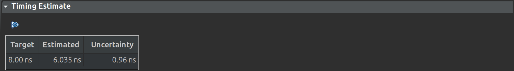

# Vitis HLS Fixed-Point Matrix Multiplication

This repository contains a Vitis HLS project for fixed-point matrix multiplication. The goal is to demonstrate how High-Level Synthesis (HLS) can be used to accelerate C++ code into efficient hardware, specifically focusing on fixed-point arithmetic and the impact of various HLS optimization pragmas.

## 1. Project Overview
This project implements a fixed-point matrix multiplication for 4x4 matrices. Fixed-point arithmetic is chosen for its balance between precision and hardware resource efficiency, making it suitable for FPGA implementations. The design is intended to be synthesized into hardware using Xilinx Vitis HLS.
**Matrix Dimensions:**
- X = 4 (Rows of Matrix A, Rows of Result Matrix C)
- Y = 4 (Columns of Matrix A, Rows of Matrix B)
- Z = 4 (Columns of Matrix B, Columns of Result Matrix C)

**Fixed-Point Precision:**
typedef ap_fixed<16, 8> fixed_digit;
This defines a 16-bit fixed-point number with 8 integer bits and 8 fractional bits.

## 2. Key Concepts
- Fixed-Point Data Types (ap_fixed): Vitis HLS provides the ap_fixed data type for arbitrary precision fixed-point numbers. This allows designers to specify the total bit width and the number of integer bits, enabling fine-grained control over precision and dynamic range, which directly impacts hardware resource usage.
- HLS Directives (Pragmas): These are special commands (#pragma HLS ...) embedded in the C++ code that guide the Vitis HLS compiler in optimizing the design for hardware. Common directives include:
  - PIPELINE: Enables parallel execution of loop iterations.
  - UNROLL: Expands a loop into parallel hardware, eliminating loop control overhead.
  - ARRAY_PARTITION: Divides large arrays into smaller arrays or individual registers to enable parallel memory access.
  - DATAFLOW: Enables task-level pipelining, allowing independent functions or loop nests to run concurrently and stream data.
Test Bench: A C++ test bench is essential for verifying the functional correctness of the HLS design. It simulates inputs, calls the HLS function, and compares the hardware-simulated outputs against a known good software reference.

## 3. Code Structure
The project consists of three main C++ files:
a. Design (matrix_mult.cpp)
This file contains the core C++ function (matrix_mult) that performs the fixed-point matrix multiplication. It is the target for HLS synthesis.
b. Header (matrix_mult.h)
This header file defines the fixed-point type, matrix dimensions, and the function prototype for matrix_mult, ensuring consistency across the design and test bench files.
c. Test Bench (matrix_mult_tb.cpp)
The test bench initializes input matrices, calls the matrix_mult function, performs a software reference calculation, and then compares the hardware-simulated results with the software reference to verify correctness.

## 4. Performance Analysis
We compared three different configurations of the matrix_mult.cpp design, analyzing their synthesis reports (csynth.rpt) for performance (Latency, II) and resource utilization (DSPs, FFs, LUTs).
### Configuration 1: No Pragmas (Baseline)
Observations from Report:
Overall Latency: 39 cycles (312 ns)
row_loop_col_loop: Pipelined with II=2.
Resources: 4 DSPs, 137 FFs, 318 LUTs, 0 BRAMs.
Analysis: Vitis HLS intelligently applied default optimizations, including pipelining the outer loops and inferring parallelism (using 4 DSPs), resulting in a surprisingly good baseline performance. Arrays were mapped to AP_MEMORY (likely BRAM-like structures with limited ports).
### Configuration 2: Array Partition + Inner Loop Pipeline
 
 
Observations from Report:
Overall Latency: 177 cycles (1416 ns)
product_loop: Pipelined with II=1.
row_loop_col_loop: Not pipelined (sequential execution of outer loops).
Resources: 1 DSP, 182 FFs, 824 LUTs, 0 BRAMs.
Analysis: While ARRAY_PARTITION complete successfully mapped arrays to registers and product_loop achieved II=1, the overall latency significantly increased. This happened because explicitly pipelining only the innermost loop prevented Vitis HLS from applying its more effective default parallelism to the outer loops. The design became largely sequential at the outer loop level, losing the benefit of the 4 parallel DSPs seen in the baseline.
### Configuration 3: Array Partition + Dataflow + Outer Loop Pipeline
 
 
Observations from Report:
Overall Latency: - (Dataflow - streaming)
col_loop: Pipelined with II=1.
Resources: 13 DSPs, 4402 FFs, 3241 LUTs, 0 BRAMs.
Analysis: This configuration achieved the highest throughput. The DATAFLOW pragma enabled task-level pipelining, allowing different parts of the matrix multiplication to execute concurrently and stream data. The col_loop achieving an II=1 means a new output element calculation can start every clock cycle. The dramatic increase to 13 DSPs confirms that Vitis HLS instantiated significant parallel hardware, making this the fastest design for continuous data processing. This performance comes at a much higher resource cost.
Summary Comparison Table
 

## 5. Conclusion on Performance
- The "AP + Dataflow + Outer Pipe" configuration (Configuration 3) is the fastest in terms of throughput for continuous matrix multiplication. While its single-run latency is not directly reported (due to the streaming nature of DATAFLOW), its ability to start a new column computation every clock cycle (II=1 for col_loop) and its high degree of parallelism (13 DSPs) means it can process a stream of matrices much faster than the other configurations.
 
- The "No Pragmas" baseline (Configuration 1) performed surprisingly well due to Vitis HLS's intelligent default optimizations. 
 
- Configuration 2, by explicitly optimizing only the inner loop, inadvertently removed the higher-level parallelism that HLS was inferring by default, leading to worse overall latency.
 

## 6. Advanced Concepts and Project Relevance
Beyond the immediate performance and resource analysis, this Vitis HLS project provides valuable exposure to several advanced compilation and debugging concepts, drawing parallels between software and hardware development flows.
### a. Scheduling
Concept: In HLS, scheduling is the process of assigning each C/C++ operation (e.g., multiplication, addition, memory access) to a specific clock cycle in the final hardware design. The scheduler aims to optimize for latency and/or throughput, respecting data dependencies and available resources.
#### Relevance to Project:
 - Direct Control: Pragmas like #pragma HLS PIPELINE and #pragma HLS DATAFLOW directly influence the scheduler. For instance, applying PIPELINE II=1 to the product_loop or col_loop explicitly instructs the scheduler to initiate a new operation every clock cycle, maximizing throughput.
 - Observable Results: The "Latency (cycles)" and "Interval (II)" metrics in the synthesis reports are direct outputs of the scheduler's decisions. I observed how the scheduler's default behavior (Configuration 1: col_loop II=2) changed drastically when provided specific guidance (Configuration 2: product_loop II=1, leading to higher overall latency) or higher-level guidance (Configuration 3: DATAFLOW and col_loop II=1, leading to maximum throughput).
 - Visual Debugging: The Vitis HLS GUI's Schedule Viewer (available after C Synthesis) provides a visual timeline of operations across clock cycles, allowing one to directly inspect the scheduler's output and understand how parallelism and pipelining are achieved.
### Binding
Concept: Binding is the process of mapping the scheduled operations and data storage elements to specific physical hardware resources on the FPGA (e.g., mapping multiplications to DSP blocks, variables to Flip-Flops, arrays to Block RAMs or distributed RAM).
#### Relevance to Project:
 - Memory Binding (ARRAY_PARTITION):
  - Default: In Configuration 1 (No Pragmas), arrays A, B, and C were likely bound to AP_MEMORY interfaces, implying mapping to BRAMs or similar memory structures with limited ports.
  - Explicit Control: Using #pragma HLS ARRAY_PARTITION variable=X complete (in Configurations 2 & 3) explicitly forced HLS to bind each array element to individual registers (Flip-Flops and LUTs). This was evident in the "HW Interfaces" section showing individual A_0_0, B_0_0, C_0_0 ports and the BRAM: - (0) in resource reports. This trade-off of BRAMs for FFs/LUTs enabled highly parallel data access.
 - Operator Binding (DSPs): The fixed-point multiplication operations were bound to dedicated DSP blocks.The varying DSP counts (4 DSPs in Configuration 1, 1 DSP in Configuration 2, and a remarkable 13 DSPs in Configuration 3 with ap_fixed<16,8>) directly illustrate how HLS binds operations to available hardware accelerators based on the parallelism it can extract.
 - Data Type Impact: Changing the fixed-point precision from ap_fixed<16, 8> to ap_fixed<32, 16> (in the Bonus section) directly impacted binding. The increased bit-width necessitated larger or more numerous arithmetic units, leading to a significant jump in DSP usage (from 13 to 39 DSPs), demonstrating how data types influence resource binding.
### c. LLVM IR (Intermediate Representation)
Concept: LLVM IR (Low-Level Virtual Machine Intermediate Representation) is a hardware-agnostic, assembly-like language used by Vitis HLS (and many other compilers) as a crucial intermediate step. The C++ code is first translated into this IR, on which high-level optimizations (like pipelining, unrolling, dataflow analysis, and array partitioning) are performed before the final Register-Transfer Level (RTL) code is generated.
#### Relevance to Project:
 - Optimization Target: While LLVM IR is not directly written, every pragma applied (PIPELINE, ARRAY_PARTITION, DATAFLOW) and every C++ coding style choice made directly influenced how Vitis HLS transformed and optimized the underlying LLVM IR. The performance and resource results observed are a direct consequence of these transformations on the IR.
 - Transparency: Vitis HLS allows inspection of the generated LLVM IR files (often .ll files found within the solution's sim directory after Co-Simulation). Examining these files can provide deeper insights into how the C++ code is represented and optimized at an intermediate level before becoming RTL. This project serves as a practical example where one can trace the impact of high-level code changes and pragmas down to this low-level representation.
### d. Debugging at FFI Boundaries
Concept: Foreign Function Interface (FFI) boundaries refer to the points where code written in one language or paradigm interacts with code written in another (e.g., Python calling C, or in this case, software interacting with hardware). Debugging at these boundaries involves ensuring data is correctly marshaled, interfaces are correctly implemented, and communication protocols are followed.
#### Relevance to Project:
 - Software-Hardware Interface: The matrix_mult_tb.cpp (software) interacts with the matrix_mult function (which becomes hardware). This is a prime FFI boundary.
 - Data Marshaling: Passing ap_fixed arrays between the software test bench and the hardware function. Ensuring that the fixed-point values are correctly represented and transferred across this boundary is a fundamental FFI challenge.
 - C/RTL Co-simulation: This Vitis HLS feature is specifically designed to debug at this FFI boundary. It runs the C++ test bench alongside the generated RTL, allowing one to detect and pinpoint any functional mismatches that occur due to incorrect data transfer, timing, or protocol adherence between the software and hardware domains. Successfully passing co-simulation ensures that the hardware behaves exactly as the software expects at this critical interface.
### e. Linux Static and Dynamic Linking Processes
Concept: In Linux software development, linking is the process of combining various compiled code and data files (object files, libraries) into a single executable program.
- Static Linking: All necessary library code is copied directly into the executable, making it self-contained but larger.
- Dynamic Linking: The executable contains references to shared libraries, which are loaded at runtime. This saves space and allows libraries to be updated independently.
- Name Mangling: C++ compilers modify (mangle) function and variable names to encode type information, allowing function overloading and type safety.
- Symbol Resolution: The linker resolves references to symbols (functions, global variables) defined in other object files or libraries.
- GNU Binutils: A collection of binary tools (like ld for linking, ar for archives, nm for listing symbols) commonly used in Linux compilation.
#### Relevance to Project:
 - Test Bench Compilation: The most direct relevance is in the compilation ofthe matrix_mult_tb.cpp test bench. This is a standard C++ application that is compiled and linked on the host machine.
  - When the C Simulation is run in Vitis HLS, it invokes a standard C++ compiler (e.g., GCC). This compiler uses tools from GNU Binutils to compile the test bench and link it with necessary libraries (like iostream for I/O, and potentially ap_fixed runtime libraries if they're not fully synthesized away).
  - During this process, name mangling occurs for C++ functions, and symbol resolution ensures that all calls (e e.g., to std::cout or the matrix_mult function prototype) are correctly linked to their definitions.

## Bonus: Configuration 3 with ap_fixed<32, 16>
Out of curiosity, I increased the precision of the fixed point numbers from ap_fixed<16, 8> to ap_fixed<32, 16>
 
The synthesis report showed a significant increase in resource utilization compared to the previous ap_fixed<16, 8> version, while maintaining the same high throughput. The number of DSPs used jumped from 13 to 39, and FFs increased from 4402 to 8369, with LUTs rising from 3241 to 4694. This is expected, as processing data with double the bit-width requires more complex and larger arithmetic units and wider registers. Crucially, the design successfully maintains its DATAFLOW characteristic (latency still -) and the col_loop still achieves an II=1, indicating that the increased precision did not compromise the high throughput and parallelism achieved by the DATAFLOW and PIPELINE pragmas. This demonstrates the direct relationship between data precision and hardware resource consumption in HLS, where higher precision translates to more demanding hardware.
 
